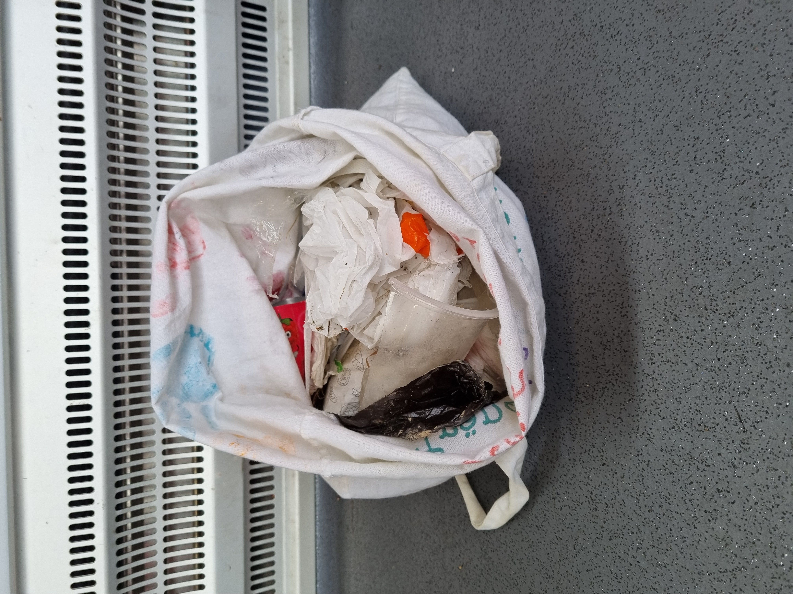

> Das ist die KI unterstützte englische Übersetzung des Originals. Die deutsche Version befindet sich [hier](README.md)

```
         _____ _                                                        ______     _   _     
        /  __ \ |                                                       | ___ \   | | | |    
        | /  \/ | ___  __ _ _ __  ___       _   _  ___  _   _ _ __      | |_/ /_ _| |_| |__  
        | |   | |/ _ \/ _` | '_ \/ __|     | | | |/ _ \| | | | '__|     |  __/ _` | __| '_ \ 
        | \__/\ |  __/ (_| | | | \__ \     | |_| | (_) | |_| | |        | | | (_| | |_| | | |
         \____/_|\___|\__,_|_| |_|___/      \__, |\___/ \__,_|_|        \_|  \__,_|\__|_| |_|
                                             __/ |                                       
                                            |___/                                                                                                                                        |___/ 
```

A silent protest action to clean up the environment from micro waste

☀️❤️☀️

Initiated by Christian Oetterli

Date of first creation: June 19, 2023

Language: English. AI assisted translation of the original german version

christian@o3tt3rli.com

+41 (0)79 500 300 8

WhatsApp:

+41 79 500 300 8

Instagram:

[g1g1.o3tt3rli](instagram-g1g1.o3tt3rli_qr.png)

# Table of contents

- [Initial position](#initial-position)
- [Action](#action)
    * [Extras](#extras)
- [Safety First](#safety-first)
- [Particularities](#particularities)
- [Travel ashtray](#travel-ashtray)
- [Arguments with interested parties](#arguments-with-interested-parties)
- [Action in everyday life](#action-in-everyday-life)
- [Effect](#effect)
- [Commit to action](#commit-to-action)
- [measure success](#measure-success)
- [Distinction from other protest actions](#distinction-from-other-protest-actions)
- [Field trials](#field-trials)
    * [Niederbipp](#niederbipp)
        + [Photo proof](#photo-proof)
    * [Solothurn](#solothurn)
- [Backpack Essentials](#backpack-essentials)
- [Positive side effects](#positive-side-effects)
- [Identification](#identification)
    * [Color](#color)
- [Planned events](#planned-events)
- [TODO](#todo)

# Initial position

The cities, meadows, rivers, seating areas, promenades are peppered with "small rubbish" such as cigarette butts, broken glass, the smallest aluminum "particles", or simply put: rubbish.
But this garbage has some peculiarities:

- the rubbish is too small to be picked up with the big "Gesteigwischer" machines or brooms, blowers. Often they are just spread further (<- provide proof)
- It's **a lot** of rubbish. Just like microplastics in the sea. It would take a lot of workers and money to properly dispose of every single thing.
- People are reluctant to pick up cigarette butts from "strangers" or don't feel responsible for other people's rubbish
- A lot of people might be willing, but the sheer volume keeps them from doing so
- You would have to duck or you just don't have the right "tool" with you
- other special features...

# Action
As is so often the case, a group of young people meet on a sunny day in a meadow, in the city park or by the lake for a get-together.
But instead of a green meadow there is a dirty square in a city.

The place should be as highly frequented as possible and as dirty as possible.

For example the Solothurn Promenade along the Aare.

Pedestrians, cyclists, skaters and families meet there. It has restaurants with terraces and views of the beautiful city of Solothurn.
It also has a large children's playground. It is neglected and, unfortunately, I don't think it is used that often.

As always, the group of actionists meets, as on a field meadow "in the past", for a picnic together.

They eat, drink (no alcohol), smoke, are in a good mood, and bluntly seek out a free one without showing anything, as if it were "normal". Places where they can spread.

But before the group starts the "party", they first make sure the environment is clean - cleans your way.

They start meticulously **cleaning the whole place**, not just "their" ones, of any junk that doesn't belong there.

It could be that a cigarette butt is under a park bench where passers-by are taking a rest. Here, permission is asked politely before approaching the person. We are decent people. If they say no, the group or person withdraws with an apology.

If necessary, a magnifying glass is used to look for even the tiniest splinters of glass. Parents should be able to let their children play on this course without hesitation.

Only when everyone in the group agrees that the place is clean enough, and that can take hours, do they start the party.
The group indulges a little and then moves on to the next filthy square where the action is repeated.
They take the rubbish with them and dispose of it properly at the rubbish collection point.

## Extras

On the way to the garbage collection point through the city, we leave nice-to-see tags in "naive children's style".
E.g. Flowers with faces, a funny face peeking out from behind a wall - pictures we used to scribble in our exercise books as kids when class got yawny again.
Pictures as we would like to see the city. As children and as adults.

The tags are drawn with easily washable, environmentally friendly children's chalk.

We also leave the tag of this promotion: ☀️❤️☀️

See also [Commit to action](#commit-to-action).

# Safety First

The group has medical supplies to be on the safe side.

Each participant can decide for themselves how far they want to go. The main thing is that the garbage is removed.

**The health of the campaigners has top priority!**

# Particularities

If possible and justifiable for the participating person, everyone in the group walks barefoot and the smallest rubbish is picked up unprotected with bare hands/fingertips/nails. Like in a meadow.
This also to show the passers-by that you don't "die" from it. "Today's children should eat more dirt again. Like in the past. Then they wouldn't have as many allergies" - as the saying goes.

Fingernails and toenails are painted in a color that is as eye-catching as possible (e.g. "Essie - Let's Party, 635"). The men too - which also causes a stir.

For the purpose of belonging, everyone in the group should use the same color.

Artificial fingernails can also be used if necessary.
The message is: I can be well-groomed, have well-groomed fingers/fingernails and still pick up a stranger's cigarette butt or cut myself on a piece of broken glass.
It even goes very well with long fingernails.

The smokers among the group should/can/may smoke during the event. Of course only if nobody feels bothered. Also THC joints. But not too much! **Safety First**.
You can also just pseudo-smoke. Many don't even notice the difference. Or put a Ziggi behind your ears.
This is how we signal: Yes, we are smokers. But not like the others. We don't just flick our butts away.
We also demonstratively use travel ashtrays so that people see: Oh... that exists?

Smoking alternatives such as liquids, vaping, Iqos, etc. are also welcome.

And don't smoke at all. We don't want to promote smoking with our "coolness".

100% non-smokers are also welcome! This is how we demonstrate tolerance between smokers and non-smokers.

It is very important that the group does not let anything be said. It's the most normal thing in the world. No one in the group raises a finger.
If a "polluter" flicks his cigarette butt in front of our feet, we don't say anything, just pick it up and dispose of it properly.

**We don't look if they look**

(but we are attentive and can hear)

Nobody should mind. We're cleaning. The party is cool. No music, not loud. We don't want to disturb the others. We are unobtrusive.

Only **if** a person turns to us and our campaign are we happy to answer their questions.
We invite the person to our party.
We have flyers/information material for them.
We also have free travel ashtrays with us to give away.

# Travel ashtray

We present our range of travel ashtrays to interested parties.

Travel ashtrays should not be branded with any logo or "moral statement".

There should be many variants/sizes. Not just one model.

The smokers should be happy to carry it with them.

# Arguments with interested parties

These arguments could be presented:

Argument:

"That doesn't make any sense. There are so many. You'll never finish it."

Answer:

Tell them the following dialogue:

> Says one to the other: "What was your name again?"
>
> Says the other: "I'm sure I've already told you that at least a thousand times!"
>
> "I can't remember every name"

Argument:

"I could get infected or hurt myself if I touch garbage with my bare hands."

Answer:

Tell them that a lot of people these days feel that today's generation is "too soft", should "eat more dirt", have developed all sorts of allergies, such as being disgusted with the paint on their hands. You didn't die from it either.

All friendly and with a wink. The answers should never be didactic.

# Action in everyday life

Actionists (all) can also dispose of small waste in their daily lives. E.g. (Night) in the train station in front of a group of "rioting" teenagers. Attention: **Safety First**!

Actionists should, of course, clean up small rubbish, even if nobody sees them.

True to the motto: Leave the place cleaner than you found it.

# Effect
We lead by example.

We want everyone to see how much effort we put in and how normal it is to clean up our place.
We are not the moralizers - it's normal.

This environmental action does no harm to anyone. We don't hinder anyone. If someone really yells, the group retreats with an apology.

The group should not have more than 5 participants. Otherwise it could be mistaken for a crowd.
The action should not have to be approved by the authorities.

# Commit to action

After the campaign has been completed, we will make a commitment to the city/municipal administration.

**Everyone should know who we are and what we stand for**

If the community incurs costs as a result of our campaign, e.g. because of the children's crayons, we will pay for them in full, although we actually work for the community.

We do this out of conviction and do not expect any praise or reward from the community or anyone else.

# Measure success
The potential success of the campaign is demonstrated using a case study.

The group observes/documents the same place over several days/weeks with photo evidence or other means.

Evidence: Have the townspeople followed our example and hasn't the amount of small waste increased noticeably?
If yes: Repeat the action, expand to other places, cities, countries.
If no: don't give up

If successful, others from other cities/countries might join us with the goal of finally ridding the world of those fucking cigarette butts.

# Distinction from other protest actions

"Cleans your Way" is a silent protest action. Nobody gets hurt. Neither the actionists nor the "goal" of the action: the other people.

We have fun cleaning up our environment.
We do not have to chain, glue or otherwise endanger our health or that of others.

I am convinced that setting a good example is more beneficial in the long term than trying to convert people with a "hard club".

# Field trials

I am a smoker and carried out the campaign personally in my place of residence Niederbipp and my home town of Solothurn.

## Niederbipp

Cleaned a seat and left a quality ashtray.
Control a week later revealed: 2 stubs on the floor, 3 stubs in the ashtray. A complete success. Statistically worthless.
A week later the ashtray was gone. Stolen? Yes. Will it continue to be used? Probably yes.
Effort: 1h

Cleaned the parking lot of a kiosk and a pizza maker.
Effort: 2 hours

Cleaned the edge of a cow meadow from tin cans, scraps of plastic, stubs and the like. Also in the meadow.
Effort: 0.5 h

Cleaned Dahlia Niederbipp's garden space. Dahlia is a care and support institution for mostly elderly people in need of care.
Cleaned an approx. 100 m long section of a road followed by a meadow.
Two seats, one parking space and area cleaned.
Effort: 3 hours

I cleaned everything around our village roundabout while, as almost always, the escape traffic was jammed through our village.
Motorists from all over the world should have deliberately ignored me so as not to have to watch me.
They also had enough time (traffic jam) to watch me.
Effort: 1.5 h

On my way to the train station, I usually dispose of rubbish (stubs and scraps) and throw it in the nearest rubbish bin.
Effort: 1-2 min

If I notice a "big fish", I sometimes take a detour to dispose of it.

### Photo proof

Began to take photo evidence late.




## Solothurn

The action was carried out on a sunny Friday afternoon. She wasn't planned. I just do it like this.

For about 2 hours, barefoot, with painted nails, unprotected and smoking, I meticulously cleared the Aare wall and a seat in front of a restaurant terrace of cigarette butts, tiny broken glass and rubbish before I took a break on the park bench.

It had many passers-by and it was quite dirty.

I think my demeanor and the fact that I "just like that" dispose of someone else's garbage, even though I obviously have nothing to do with the local government, caused a lot of attention.
I don't know because I don't look if they look. But I strongly assume so.

I work very gently and also meditate at the same time.

I haven't hurt myself. No scratches, no nothing. I don't know anything about infections until now. I am doing very well.

After my action, I demonstratively wash my hands with my drinking water and disinfect them before I take a break.

I don't have any special equipment with me. Sometimes you can find a McDonalds mug. Unfortunately too often, but that's not McDonald's fault. You can then fill the cup with the other garbage and dispose of it in the next garbage can.

I'm a normal hiker with no special equipment.

I haven't separated the garbage yet - I'll improve that.
Take aluminum, beer mats, plastic, etc. with you. Depending on size. Glass is too dangerous for me.

What's important is the message that I can dispose of the rubbish that comes my way, even without special equipment, even if it's just a single cigarette butt.

# Backpack Essentials

These essential items are recommended for the promotion.

All things should not be missing in any hiking backpack.

- Garbage bag
- A cup. E.g. an Emmi Cafe Latte, Starbucks or a coffee-to-go cup. I can easily fill them with stubs while I walk
- A water bottle for daily needs like drinking, washing hands, cleaning small areas
- Sunglasses and sunscreen
- disinfectant
- A Swiss army knife, of course
- (tobacco products)
- mascot
- (No gloves or medical supplies yet. I'll get them for emergencies. I should always have them with me. Safety first!)


# Positive side effects

- I often meditate while cleaning
- I practice coordinated movements and grasping. Like a sushi chef, for example, where every move has to be perfect.
- I use bending/up and down to train my legs/joints
- I "eat more dirt again" and "don't die from it". Since Corona, I've just been touching things again and freeing myself from my "irrational fears of infection"

# Identification

The logo/tag of this promotion is this Unicode string:

☀️❤️☀️

## Color


Essie - Let's Party, 635


# Planned events

- 1.7.2023, 09:30. Alterswohnungen, Schule/Pausenplatz, Bahnhof
- 2.7.2023, 09:30. Spielplatz beim Bahnhof, Schule Oberstufe
- 2.9.2023, 11:00. Zürich Bahnhofstrasse, [World Cleanup Day Event](https://www.worldcleanupday.org/event?name=saubere_deinen_weg_e_cleans_your_path_7Dp)

# TODO

🔲 Contact Essie for support. As a "beauty products manufacturer" you could set an example by officially supporting an environmental campaign with your nail polish.

🔲 What to do with syringes, fixer utensils and the like? Leaving is not an option.

🔲 Is it ok to consume energy drinks like Red Bull during the promotion? Other "grey" areas?

🔲 Travel ashtray Amazon/AliExpress or other web links to buy

🔲 Who funds the costs for flyers, travel ashtrays, etc?

🔲 More?

