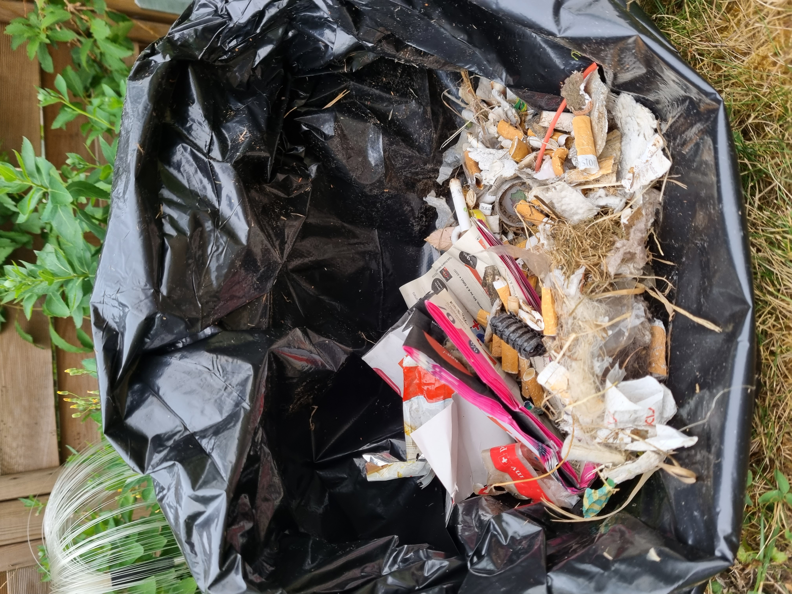

> This is the german version of the document. The AI assisted translation in english can be found [here](README-en.md)

```
       _____ _   _       _                           _      _                      _    _            
      /  ___(_) (_)     | |                         | |    (_)                    | |  | |           
      \ `--.  __ _ _   _| |__   ___ _ __ ___      __| | ___ _ _ __   ___ _ __     | |  | | ___  __ _ 
       `--. \/ _` | | | | '_ \ / _ \ '__/ _ \    / _` |/ _ \ | '_ \ / _ \ '_ \    | |/\| |/ _ \/ _` |
      /\__/ / (_| | |_| | |_) |  __/ | |  __/   | (_| |  __/ | | | |  __/ | | |   \  /\  /  __/ (_| |
      \____/ \__,_|\__,_|_.__/ \___|_|  \___|    \__,_|\___|_|_| |_|\___|_| |_|    \/  \/ \___|\__, |
                                                                                                __/ |
                                                                                                |___/ 
```

Eine stille Protestaktion zur Säuberung der Umwelt von Kleinstmüll

☀️❤️☀️

Initiiert von Christian Oetterli

Datum der Ersterstellung: 19. Juni, 2023

Sprache: Deutsch (original)

christian@o3tt3rli.com

+41 (0)79 500 300 8

WhatsApp:

+41 79 500 300 8

Instagram:

[g1g1.o3tt3rli](instagram-g1g1.o3tt3rli_qr.png)

#  Inhaltsverzeichnis

- [Ausgangslage](#ausgangslage)
- [Aktion](#aktion)
    * [Extras](#extras)
- [Safety First](#safety-first)
- [Besonderheiten](#besonderheiten)
- [Reiseaschenbecher](#reiseaschenbecher)
- [Argumentation mit Interessierten](#argumentation-mit-interessierten)
- [Aktion im Alltag](#aktion-im-alltag)
- [Effekt](#effekt)
- [Zu Aktion bekennen](#zu-aktion-bekennen)
- [Erfolg messen](#erfolg-messen)
- [Abgrenzung zu anderen Protestaktionen](#abgrenzung-zu-anderen-protestaktionen)
- [Feldversuche](#feldversuche)
    * [Niederbipp](#niederbipp)
        + [Fotobeweise](#fotobeweise)
    * [Solothurn](#solothurn)
- [Rucksack Essentials](#rucksack-essentials)
- [Positive Nebeneffekte](#positive-nebeneffekte)
- [Identifikation](#identifikation)
    * [Farbe](#farbe)
- [Geplante Events](#geplante-events)
- [TODO](#todo)

# Ausgangslage

Die Städte, Wiesen, Flüsse, Sitzplätze, Promenaden sind gespickt mit "Kleinstmüll" wie Zigarettenstummel, Glasscherben, kleinste Aluminium "Partikel", oder einfach gesagt: Müll.
Dieser Müll hat aber einige Besonderheiten:

- der Müll ist zu klein, um von den grossen "Gesteigwischer" Maschinen oder Besen, Bläser erfasst zu werden. Oft werden sie nur einfach weiter verstreut.
- Es ist **viel** Müll. Genauso wie Mikroplastik im Meer. Es braucht sehr viele Arbeiter und Geld, um jedes einzelne Ding fachgerecht zu entsorgen.
- Man hebt ungern Zigarettenstummel von "Fremden" auf, oder fühlt sich nicht für fremden Müll verantwortlich/zuständig
- Viele Leute wären vielleicht bereit dazu, die schiere Menge aber hält sie davon ab
- Man müsste sich ducken oder hat gerade nicht das geeignete "Werkzeug" dabei
- weitere...

# Aktion

Eine Gruppe von Jugendlichen trifft sich, wie so oft, an einem sonnigen Tag auf einer Wiese, im Stadtpark oder am See zu einem gemeinsamen Beisammensein.
Aber anstatt einer grünen Wiese ist es ein verdreckter Platz in einer Stadt.

Der Platz sollte möglichst hoch frequentiert und möglichst verdreckt sein.

Z.B. die Solothurner Promenade entlang der Aare.

Da treffen sich Fussgänger, Fahrradfahrer, Skater, Familien. Es hat Restaurants mit Terrasse und Blick auf die wunderschöne Stadt Solothurn.
Es hat auch einen grossen Kinderspielplatz. Er ist verwahrlost und wird, glaube ich, leider nicht so oft benutzt.

So wie immer, trifft sich die Gruppe der Aktionisten, wie auf einer Feldwiese "früher", zum gemeinsamen Picknick.

Sie haben zu essen, zu trinken (kein Alkohol) und zu rauchen dabei (höchstens THC Joints, keine "harten" Drogen), sind guter Laune und suchen sich unverblümt, ohne sich etwas anzumerken, wie wenn es "normal" wäre, ein freies Plätzchen, wo sie sich ausbreiten können.

Bevor die Gruppe aber mit der "Party" beginnt, sorgt sie erst mal für ein sauberes Umfeld - Säubere deinen Weg.

Sie beginnen penibel **den ganzen Platz**, nicht nur "ihren" von jedwedem Unrat zu befreien, der da nicht hingehört.

Es könnte sein, dass sich ein Zigarettenstummel unter einer Parkbank befindet, wo gerade Passanten eine Rast machen. Hier wird erst höflichst um Erlaubnis gebeten, bevor man sich der Person nähert. Wir sind anständige Menschen. Bei einem Nein zieht sich die Gruppe oder Person mit einer Entschuldigung zurück.

Wenn es sein muss, wird mit der Lupe nach dem noch so kleinsten Glassplitter gesucht. Eltern sollten ihre Kinder auf diesem Platz ohne Bedenken spielen lassen können.

Erst wenn alle der Gruppe der Meinung sind, dass der Platz sauber genug ist, und das kann Stunden dauern, beginnen sie mit der Party.
Die Gruppe lässt es sich ein wenig gut gehen, und zieht dann weiter zum nächsten verdreckten Platz, wo die Aktion erneut durchgeführt wird.
Den Müll nehmen sie mit und entsorgen ihn fachgerecht an der Müllsammelstelle.

## Extras

Auf dem Weg zur Müllsammelstelle durch die Stadt hinterlassen wir schön anzusehende Tags im "naiven Kinder Stil".
Z.b. Blumen mit Gesichtern, ein lustiges Gesicht, dass hinter einer Wand hervorlugt - Bilder, die wir als Kinder in das Schulheft gekritzelt haben, als der Unterricht mal wieder zum Gähnen war.
Bilder, so wie wir die Stadt gerne sehen möchten. Als Kinder und als Erwachsene.

Die Tags werden mit leicht abwaschbarer, umweltverträglicher Strassenkreide gezeichnet.

Wir hinterlassen auch das Tag dieser Aktion: ☀️❤️☀️

Siehe auch [Zu Aktion bekennen](#zu-aktion-bekennen).

# Safety First

Die Gruppe verfügt zur Sicherheit über medizinische Versorgung.

Jede teilnehmende Person kann für sich entscheiden, wie weit sie gehen will. Hauptsache, der Müll wird beseitigt.

**Die Gesundheit der Aktionisten hat oberste Priorität!** 

# Besonderheiten

Wenn möglich und für die teilnehmende Person vertretbar sind alle der Gruppe barfuss unterwegs und der Kleinstmüll wird mit blossen Händen/Fingerspitzen/Nägeln ungeschützt aufgepickt. Wie auf einer Wiese.
Dies auch, um den Passanten zu zeigen, dass man daran nicht "stirbt". "Die Kinder heutzutage sollten wieder mehr Dreck essen so wie wir früher. Dann hätten sie auch nicht mehr so viele Allergien" - wie der Volksmund sagt.

Finger- und Zehennägel sind in einer möglichst auffälligen Farbe lackiert. Auch die Männer - was zusätzlich Aufsehen erregt.

Siehe auch [Identifikation](#identifikation).

Zum Zweck der Zugehörigkeit sollten alle der Gruppe dieselbe Farbe verwenden.

Bei Bedarf können auch künstliche Fingernägel verwendet werden.
Die Message ist: Ich kann gepflegt sein, gepflegte Finger/Fingernägel haben und trotzdem einen Zigarettenstummel eines Fremden aufheben oder mich an einem Glassplitter schneiden.
Es geht sogar sehr gut mit langen Fingernägeln.

Die Raucher unter der Gruppe sollten/können/dürfen während der Aktion rauchen. Natürlich nur, wenn sich niemand belästigt fühlt. Auch THC Joints. Aber nicht zu viel! **Safety First**.
Man kann auch nur Pseudo-Rauchen oder CBD. Den Unterschied merken viele gar nicht. Oder eine Ziggi hinter die Ohren klemmen.
So signalisieren wir: Ja, wir sind Raucher. Aber nicht so wie die anderen. Wir schnippen unsere Kippen nicht einfach weg.
Wir verwenden auch demonstrativ Reiseaschenbecher, damit die Leute sehen: Ach...das gibt es?

Auch Rauchalternativen wir Liquids, Dampfen, Iqos usw sind willkommen.

Und auch gar nicht rauchen. Wir wollen mit unserer "coolness" ja nicht das Rauchen fördern.

Auch 100 % Nichtraucher sind herzlich willkommen! So demonstrieren wir Toleranz zwischen Rauchern und Nichtrauchern.

**Keine "harten" Drogen und Alkoholika, Medikamente, Leim- und Benzinschnüffeln und was nicht**

Obwohl einige von uns vielleicht vor "Publikum" kiffen und stoned sind, darf niemals der Eindruck entstehen, wir seien unkonzentriert und nur zum Abhängen oder Chillen da. Nein! Wir sind hier unsere Umwelt zu reinigen und haben auch noch Spass dabei.

Sehr wichtig ist, dass die Gruppe sich nichts anmerken lässt. Es ist das normalste der Welt. Niemand der Gruppe hebt den Zeigefinger.
Wenn uns ein "Verschmutzer" seine Zigarettenkippe vor die Füsse schnippt, sagen wir gar nichts, heben sie auf und entsorgen sie fachgerecht.

**Wir schauen nicht, ob sie schauen**

(aber wir sind aufmerksam und können hören)

Niemand sollte etwas dagegen haben. Wir machen ja sauber. Die Party ist cool. Keine Musik, nicht laut. Wir wollen die anderen nicht stören. Wir sind unaufdringlich.

Nur **falls** sich eine Person uns und unserer Aktion zuwendet, beantworten wir gerne deren Fragen.
Wir laden die Person zu unserer Party ein.
Wir haben Flyers/Infomaterial für sie dabei.
Wie haben auch gratis Reiseaschenbecher dabei.

# Reiseaschenbecher

Interessenten stellen wir unser Reiseaschenbechersortiment vor.

Reiseaschenbecher sollten mit keinem Logo oder "Moralspruch" versehen sein.

Es sollte viele Varianten/Grössen geben. Nicht nur genau ein Modell.

Die Raucher sollten ihn gerne bei sich tragen wollen.

# Argumentation mit Interessierten

Diese Argumente könnten vorlegt werden:

Argument:

"Das mach doch keinen Sinn. Es sind so viele. Da wird man ja nie fertig"

Antwort:

Erzähle ihnen folgenden Dialog:

> Sagt der eine zum anderen: "Wie war dein Name auch schon wieder?"
>
> Sagt der andere: "Aber den habe ich dir doch sicher schon mindestens tausendmal gesagt!"
> 
> "Ich kann mir ja nicht jeden Namen merken"

Argument:

"Ich könnte mich infizieren oder verletzen, wenn ich Müll mit blossen Händen anfasse."

Antwort:

Erzähle ihnen, dass viele Leute heutzutage der Meinung sind, die heute Generation sei "zu verweichlicht", sollten "mehr Dreck essen", hätten allerlei Allergien entwickelt, ekeln sich z.B. vor Farbe an ihren Händen. Man sei ja auch nicht daran gestorben.

Alles freundlich und mit einem Augenzwinkern. Die Antworten sollten niemals belehrend wirken.

...weitere

# Aktion im Alltag

Aktionisten (alle) können auch in ihrem täglichen Leben Kleinstmüll entsorgen. Z.b. (Nachts) im Bahnhof vor einer Gruppe "randalierender" Teenager. Achtung: **Safety First**!

Aktionisten sollten, selbstverständlich, Kleinstmüll aufräumen, auch wenn niemand sie sieht.

Frei nach dem Motto: Verlasse den Platz sauberer als du ihn vorgefunden hast.

# Effekt

Wie gehen mit gutem Beispiel voran.

Alle sollen sehen, wie viel Mühe und wir uns geben, und wie normal es ist, unseren Platz zu säubern.
Wir sind nicht die Moralapostel - es ist ja normal.

Diese Umweltaktion schadet niemandem etwas. Wir behindern niemanden. Wenn jemand wirklich aufschreit, zieht sich die Gruppe mit einer Entschuldigung zurück.

Die Gruppe sollte nicht mehr als 5 Teilnehmer haben. Ansonsten könnte man es für einen Menschenauflauf halten.
Die Aktion sollte so bei der Behörde nicht bewilligt werden müssen.

# Zu Aktion bekennen

Nach Vollzug der Aktion bekennen wir uns bei der Stadt/Gemeindeverwaltung.

**Alle sollen wissen, wer wir sind und wofür wir einstehen**

Falls der Gemeinde durch unsere Aktion Kosten entstehen würden, z.B. wegen der Kindermalkreide, werden wir vollumfänglich dafür aufkommen, obwohl wir eigentlich für die Gemeinde arbeiten.

Wir machen das aus Überzeugung und erwarten kein Lob oder eine Belohnung von der Gemeinde oder von irgendjemanden sonst.

# Erfolg messen

Der potenzielle Erfolg der Aktion wird an einem Fallbeispiel belegt.

Die Gruppe observiert/dokumentiert mit Fotobeweis oder anderen Mitteln denselben Platz über mehrere Tage/Wochen.

Beweise: Haben sich die Stadtbewohner an uns ein gutes Beispiel genommen und der Kleinstmüll ist nicht merklich gestiegen?
Wenn Ja: Die Aktion wiederholen, ausdehnen auf weitere Plätze, Städte, Länder.
Wenn Nein: Nicht aufgeben

Bei Erfolg, schliessen sich womöglich andere aus anderen Städten/Ländern uns an mit dem Ziel, die Welt endlich von diesen verfickten Zigarettenstummeln zu befreien.

# Abgrenzung zu anderen Protestaktionen

"Säubere deinen Weg" ist eine stille Protestaktion. Niemand kommt zu Schaden. Die Aktionisten nicht und auch nicht das "Ziel" der Aktion: die anderen Menschen.

Wir haben Spass während wir unsere Umwelt reinigen.
Wir müssen uns nicht anketten, ankleben oder anderweitig unsere Gesundheit und die der anderen gefährden.

Ich bin überzeugt, mit gutem Beispiel voranzugehen bringt längerfristig mehr als mit der "harten Keule" die Menschen bekehren zu wollen.

# Feldversuche

Ich bin Raucher und Kiffer und habe die Aktion persönlich in meinem Wohnort Niederbipp und meinem Heimatort Solothurn durchgeführt.

## Niederbipp

Einen Sitzplatz gesäubert und einen hochwertigen Aschenbecher dagelassen.
Kontrolle eine Woche später hat ergeben: 2 Stummel am Boden, 3 Stummel im Aschenbecher. Ein voller Erfolg. Statistisch gesehen wertlos.
Eine Woche später war der Aschenbecher weg. Gestohlen? Ja. Wird er weiter benutzt? Wahrscheinlich Ja.

Aufwand: 1h

Den Parkplatz eines Kiosks und eines Pizzabäckers gereinigt.

Aufwand: 2 h

Den Rand einer Kuhwiese von Blechdosen, Plastikfetzen, Stummeln und dergleichen gereinigt. Auch in der Wiese.

Aufwand: 0.5 h

Den Gartenplatz von Dahlia Niederbipp gereinigt. Dahlia ist eine Pflege- und Betreuungsinstitution für meist ältere, pflegebedürftige Menschen.
Einen ca. 100 m langen Abschnitt einer Strasse mit anschliessender Wiese gereinigt.
Zwei Sitzplätze, einen Parkplatz und Umgebung gereinigt.

Aufwand: 3 h

Ich habe rund um unseren Dorfkreisel alles gesäubert, während, wie fast immer, der Fluchtverkehr sich durch unser Dorf staute.
Autofahrer aus allen Herren Länder hätten mich absichtlich ignorieren müssen, um mir dabei nicht zusehen zu müssen.
Auch hatten sie genügend Zeit (Stau), mir dabei zuzusehen.

Aufwand: 1.5 h

Auf meinem Weg zum Bahnhof entsorge ich meist Unrat (Stummel und Fetzen) und werfe es in den nächsten Mülleimer.

Aufwand: 1-2 min

Wenn mir ein "grosser Fisch" auffällt, mache ich auch mal einen Umweg um ihn zu entsorgen.

### Fotobeweise

Habe erst spät begonnen, Fotobeweise zu machen.




## Solothurn

Die Aktion wurde an einem sonnigen Freitagnachmittag durchgeführt. Sie war nicht geplant. Ich mache das einfach so.

Über ca. 2 Stunden habe ich barfuss, mit lackierten Nägeln, ungeschützt und kiffend die Aaremauer und einen Sitzplatz vor einer besuchten Restaurantterrasse penibelst von Zigarettenstummeln, kleinsten Glasscherben und Unrat befreit, bevor ich auf der Parkbank eine Rast einlegte.

Es hatte viele Passanten und es war ziemlich verschmutzt.

Ich denke, durch mein Auftreten und der Tatsache, dass ich "einfach so" fremden Müll entsorge, obwohl ich offensichtlich nichts mit der Gemeindeverwaltung zu tun habe, viel Aufsehen erregt habe.
Ich weiss es nicht, da ich nicht schaue, ob sie schauen. Ich gehe aber stark davon aus.

Ich arbeite sehr behutsam und meditiere dabei auch.

Ich habe mich nicht verletzt. Keine Kratzer, kein gar nichts. Von Infektionen weiss ich bis jetzt nichts. Es geht mir sehr gut.

Nach meiner Aktion wasche ich demonstrativ meine Hände mit meinem Trinkwasser und desinfiziere sie, bevor ich eine Rast einlege.

Ich habe kein spezielles Equipment dabei. Manchmal findet man einen McDonalds Becher. Leider zu oft, aber das ist nicht die Schuld von McDonalds. Den Becher kann man dann grad mit dem anderen Müll befüllen und im nächsten Mülleimer entsorgen.

Ich bin ein ganz normaler Wanderer ohne spezielles Equipment.

Ich habe den Müll noch nicht getrennt - das werde ich verbessern.
Z.B. Aluminium, Bierdeckel, Plastik usw. mitnehmen. Je nach Grösse. Glas ist mir zu gefährlich.

Wichtig ist die Message, dass ich auch ohne spezielles Equipment mal eben so fremden Müll entsorge, der mir gerade über den Weg läuft, auch wenn es nur ein einzelner Zigarettenstummel ist.

# Rucksack Essentials

Diese essenziellen Dinge werden für die Aktion empfohlen.

Alle Dinge sollten in keinem Wanderrucksack fehlen.

- Müllbeutel
- Einen Becher. Z.B. einen Emmi Cafe Latte, Starbucks oder Coffee-to-go Becher. Die kann ich leicht mit Stummeln befüllen, während ich laufe
- Eine Wasserflasche für den täglichen Bedarf wie Trinken, Händewaschen, kleinere Flächen putzen
- Sonnenbrille und Sonnenschutz 
- Desinfektionsmittel
- Natürlich ein Schweizer Taschenmesser
- (Raucherwaren)
- Maskottchen
- (Noch keine Handschuhe oder medizinische Versorgung. Werde ich mir beschaffen für den Notfall. Sollte ich immer mit dabei haben. Safety first!)


# Positive Nebeneffekte

- Ich meditiere oft während dem ich reinige
- Ich übe mich in koordinierten Bewegungen und Greifen. Wie z.B. ein Sushikoch, bei dem jeder Handgriff perfekt sein muss.  
- Ich nutze das Bücken/Auf und Ab als Training für meine Beine/Gelenke
- Ich "esse wieder mehr Dreck" und "sterbe nicht daran". Ich fasse seit Corona Dinge wieder einfach so an und löse mich so von meinen "irrationalen Infektionsängsten"

# Identifikation

Das Logo/Tag dieser Aktion ist diese Unicode Zeichenfolge:

☀️❤️☀️

## Farbe


Essie - Let's Party, 635


# Geplante Events

- 1.7.2023, 09:30. Alterswohnungen, Schule/Pausenplatz, Bahnhof
- 2.7.2023, 09:30. Spielplatz beim Bahnhof, Schule Oberstufe
- 2.9.2023, 11:00. Zürich Bahnhofstrasse, [World Cleanup Day Event](https://www.worldcleanupday.org/event?name=saubere_deinen_weg_e_cleans_your_path_7Dp) 

# TODO

🔲 Essie um Support anfragen. Sie könnten als "Beauty Produkte Hersteller" ein Zeichen setzen, indem sie eine Umweltaktion offiziell mit ihrem Nagellack unterstützen.

🔲 Was ist zu tun mit Spritzen, Fixerutensilien und dergleichen? Liegenlassen ist keine Option.

🔲 Ist es ok, während der Aktion Energydrinks wie Red Bull zu konsumieren? Andere "graue" Bereiche?

🔲 Reiseaschenbecher Amazon/AliExpress o.a. Web Links zum Kaufen

🔲 Wer finanziert Kosten für Flyers, Reiseaschenbecher usw?

🔲 Mehr?
